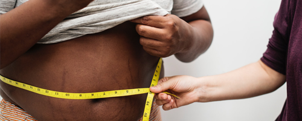
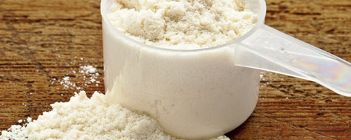
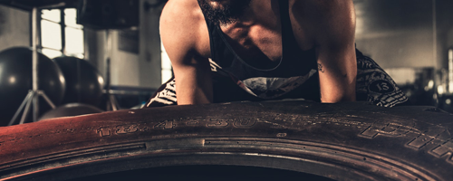
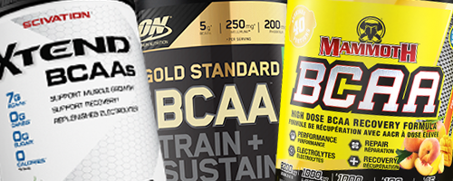

# BCAA for Weight Loss - Do BCAAs help you lose weight and gain muscle mass?

## What you need to know about BCAAs

- BCAAs are very important to **building muscle mass, aiding in muscle recovery and energy**. Having muscle mass of course positively affects your metabolism, which is crucial in **weight loss**.
- Leucine is the most beneficial of the three BCAAs, so when buying **find the product with a decent amount of Leucine**.
- BCAAs help when on a weight training (*resistance*) and/or fat loss program.

 

## What are BCAAs?

Branched-chain amino acids (BCAAs) are among the **essential** amino acids for humans, they are:
 - Valine, 
 - Isoleucine, and 
 - Leucine. 
 

They are considered essential because **your body cannot make them** and you must **get them from your diet**.

They help in **muscle growth and recovery**. Since most protein sources are rich in them, it's usually unnecessary to supplement them. However, they are often taken with the goal of **boosting muscle growth and enhancing exercise performance** during weight training.

 

## When and How to use BCAAs?

Generally speaking the benefits of BCAAs are apparent whenever you take them (after, before or during your workout) as mentioned in this [study](https://www.ncbi.nlm.nih.gov/pubmed/15173434) by *The Department of Materials* Science and Engineering at Nagoya Institute of Technology in Japan.   
The study concluded that "**BCAA supplementation before and after exercise has beneficial effects** for decreasing exercise-induced muscle damage and promoting muscle-protein synthesis; this suggests the possibility that BCAAs are a useful supplement in relation to exercise and sports".

### Taking BCAAs before or during a workout

Drinking BCAAs (which is the **easiest way** to get them in, in interesting quantities) a little while before or during your workout will give you a bit of a buffer against catabolism (in other words **breaking down protein molecules**). 

They might help with your energy levels during your training session, but that generally depends on which product you're buying.

### Taking BCAAs after a workout

Drinking BCAA's after your workout will help with the process of rebuilding muscle tissue and gaining muscle mass.

### Taking BCAAs fasted

If you're working out fasted (say, no solid meals in the 16 hours, either for intermittent fasting or some other reason), BCAAs can play the role of *real* protein for a while.

 

## Do BCAAs help you lose weight? And do they work?

### Fat Loss and Muscle Gain

Branched-chain amino acids may aid in losing weight, as concluded in a [study](https://www.ncbi.nlm.nih.gov/pmc/articles/PMC3313152/) conducted by the *Weider Research Group* on "Thirty-six strength-trained males with a minimum of two years resistance-training experience".  
The study concluded that **ingesting BCAAs while on a weight training program resulted in a great decrease in percent body fat** and "an increase in lean mass, and strength gains on the bench press and squat" in comparison to the *"ingestion of a whey supplement or a sports drink".

### Helping in rebuilding muscle tissue after a training session

Another [study](https://www.ncbi.nlm.nih.gov/pubmed/22569039) by *The School of Life Sciences at Northumbria University* conducted on "12 males" concluded that taking BCAAs before and after workouts **reduces muscle damage and increases recovery speed**.

 

## How much BCAA should I take to lose weight?

Just like regulating your protein intake, BCAAs are basically the same. Adding more is not necessarily much better and sometimes they're not helpful at all. BCAA dosage heavily depends on your gender and how active you are.

### BCAA dosage and losing weight

**One or two servings** are the general recommended dosage for losing weight. However, if you're doing fasted workouts, It is advised to add in another serving (*So 2 for standard exercices, 3 for fasted*).

### BCAA dosage and how active you are

So how much BCAAs should you take? It depends on your level of activity:
- **For relatively active people** (*2-3 weight training sessions per week*): One serving before and a second one after your workout is usually enough.
- **For very active people** (*+3 days per week*): Add in another serving right before bed to help with muscle recovery.
- **For the extremely active** *(~6 days per week*): The suggested number is generally 4, provided you spread those servings throughout the day.

### BCAA dosage and your gender, How much BCAAs for women?

Generally speaking, women do not need as much BCAAs as men in order to achieve a fitness goal.  
However, it is generally believed that women only need between **5g-10g of BCAAs per day** (that translates to 1 to 2 servings), whereas men might consume between 10g-20g per day. (It of course heavily depends on the factors mentioned above).

 

## What are the side effects of BCAAs? Are they safe?

Most expert nutritionists suggest that daily consumption of BCAAs is safe, provided not in excess quantities (**More than ~20g per day**).

### Side effects of too much BCAAs

Taking **too much** BCAAs may cause fatigue, nausea, headaches and might in some cases cause increased insulin resistance (which may cause Type 2 Diabetes).

### When NOT to take BCAAs?

- If you drink **too much** alcohol
- If you're having surgery because they affect blood sugar levels.
- If you have one of the following conditions:
  - Maple Syrup Urine Disease
  - Kidney Disease
  - Heart Disease
  - Lou Gehrig's Disease (ALS)

 

## How to buy BCAAs?

1. **Choose what you feel comfortable taking in:**
    - **Powder**: You might able to drink it with water as you're progressing through your workout.
    - **Tablets/Capsules**: If you want to just get it over with, then tablets and capsules are the way to go.

1. **Choose a good ratio:**  
    The ratio is a very important thing to consider, as mentioned earlier **Leucine is the most important of the amino acids**.  
    Ratios are written like this X.Y.Z (for example 3.1.1), the first number stands for Leucine. So it is advised to **go for a product with a good amount of leucine**.

1. **Price, obviously:**  
    Choose a product according to your budget, however, be picky and know what you get into your system (Cheap might be cheap for your body as well).

 

## References

https://en.wikipedia.org/wiki/Branched-chain_amino_acid
https://www.reddit.com/r/Fitness/comments/29okyo/can_anyone_help_me_understand_the_need_for_bcaas/  
https://www.healthline.com/nutrition/bcaa
https://www.ncbi.nlm.nih.gov/pmc/articles/PMC3313152/
https://www.ncbi.nlm.nih.gov/pubmed/22569039
https://www.ncbi.nlm.nih.gov/pubmed/15173434
https://ronniecoleman.net/blogs/articles/beginners-guide-to-bcaas
https://ironjunkies.com/bcaa-dosage
https://blog.blenderbottle.com/all-about-bcaas-bcaa-benefits-uses-and-side-effects  
http://blog.imprettyfit.com/supplements/bcaa-supplements-for-fat-loss/  
https://athleticmuscle.net/best-bcaas-for-men/
