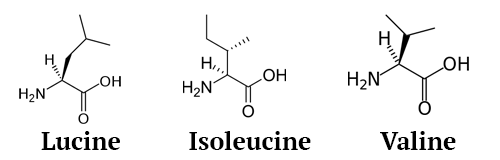
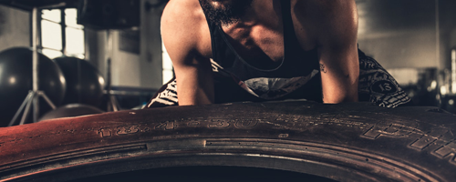
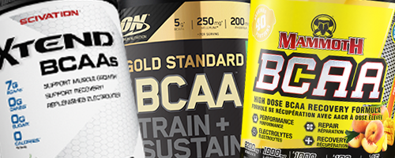

# les BCAAs - Les BCAA vous aident-ils à perdre du poids et à gagner de la masse musculaire en même temps?

## Ce qu'il faut savoir sur les BCAAs

- Les BCAA sont très importants pour **construire de la masse musculaire, accélérer la récupération musculaire et de l'énergie**. Bien entendu, la masse musculaire affecte positivement votre métabolisme, ce qui est crucial pour **perdre du poids**.
- La Leucine est le plus bénéfique des trois BCAA. Par conséquent, lorsque vous achetez **trouvez le produit avec une quantité décente de leucine**.
- Les BCAA aident lors d'un programme de musculation (*résistance*) et/ou de perte de poids.

 

## C'est quoi les BCAAs?

Les acides aminés ramifiés (BCAA) font partie des **acides aminés essentiels** pour nous, ils sont:
 - Valine,
 - Isoleucine, et
 - Leucine.

 

Ils sont considérés comme essentiels parce que **votre corps ne peut pas les fabriquer** et vous devez **les récupérer grâce à votre régime**.

Ils aident à la croissance **musculaire et à la récupération**. Étant donné que la plupart des sources de protéines en sont riches, il est généralement inutile de les prendre. Mais, ils sont souvent pris dans l'objectif de **stimuler la croissance musculaire et d'améliorer les performances physiques** lors de la musculation.

 

## Quand et Comment utiliser les BCAAs?

En générale, les avantages des BCAA sont évidents n'importe quand vous les prenez (après, avant ou pendant votre séance d’entraînement), comme mentionné dans cette [étude](https://www.ncbi.nlm.nih.gov/pubmed/15173434) par *The Department of Materials* Science and Engineering at Nagoya Institute of Technology en Japon.   
L'étude a conclu que "**la supplémentation en BCAA avant et après une séance de muscilation a des effets bénéfiques** en réduisant les dommages musculaires induits par l'exercice et en favorisant la synthèse des protéines musculaires; cela suggère la possibilité que les BCAA soient un complément utile en matière d'exercice et de sport".

### Prendre des BCAA avant ou pendant une séance d'entraînement

Boire des BCAAs (qui est le **moyen le plus simple** de les intégrer dans notre système, en quantités intéressantes) un peu avant ou pendant votre séance d’entraînement vous procurera un peu de protection contre le catabolisme (en d’autres termes, **décomposition des molécules de protéines**).

Ils pourraient vous aider avec votre niveau d'énergie pendant votre séance d'entraînement, mais cela dépend généralement du produit que vous achetez.

### Prendre des BCAA après une séance d'entraînement

La consommation de BCAA après votre entraînement vous aidera à reconstituer le tissu musculaire et à acquérir  de la masse musculaire.

### Prendre des BCAAs en jeûnant

Si vous faites de la musculation en jeûnant (par exemple, pas de repas dans 16 heures, que ce soit pour un jeûne intermittent ou pour une autre raison), les BCAA peuvent jouer le rôle de *vraie* protéine pendant un certain temps.

 

## Les BCAA vous aident-ils à perdre du poids?

### Perte de poids et gain musculaire

Les acides aminés à chaîne ramifiée peuvent aider à perdre du poids, comme la conclut une [étude](https://www.ncbi.nlm.nih.gov/pmc/articles/PMC3313152/) menée par le *Weider Research Group* sur "36 hommes entraînés et ayant au moins deux ans d'expérience dans un programme de musculation de résistance".  
L'étude a conclu que **l'ingestion des BCAAs pendant un programme de musculation entraînait une forte diminution du pourcentage de graisse corporelle** et "une augmentation de la masse maigre, ainsi que des gains de force sur le *bench press* et le squat" par rapport à "l'ingestion d'un supplément de whey ou boissons sportives".

### Aider à reconstruire le tissu musculaire après une séance d'entraînement

Une autre [étude](https://www.ncbi.nlm.nih.gov/pubmed/22569039) par *The School of Life Sciences at Northumbria University* menée sur "12 hommes" a conclu que la prise des BCAAs avant et après l'entraînement **réduit les dommages musculaires et augmente la vitesse de récupération**
 

## Combien de BCAA devrais-je prendre?

Tout comme pour la whey, les BCAA sont fondamentalement les mêmes. Ajouter plus n'est pas nécessairement beaucoup mieux et parfois ils ne sont pas utiles du tout. La quantité de BCAA à prendre dépend fortement de votre sexe et de votre niveau d’activité.

### La quantité de BCAA et la perte de poids

**Une ou deux portions** sont la dose générale recommandée pour perdre du poids. Toutefois, si vous faites des séances d’entraînement plus en jeûnant, il est conseillé d’ajouter une autre portion (*Donc 2 pour les exercices standard, 3 en jeûnant*).

### La quantité de BCAA et votre niveau d’activité

- **Pour les personnes relativement actives** (*2-3 séances de musculation par semaine*): Une portion avant et une seconde après l'entraînement suffisent généralement.
- **Pour les personnes très actives** (*+3 jours par semaine*): Ajoutez une autre portion juste avant de dormir pour aider la récupération musculaire.
- **Pour les très actifs** *(~ 6 jours par semaine*): Le nombre suggéré est généralement 4, à condition que vous répartissiez ces portions tout au long de la journée.

### La quantité de BCAA et votre sexe, Combien de BCAAs pour les femmes?

De manière générale, les femmes n'ont pas besoin d'autant de BCAA que les hommes pour atteindre un objectif de remise en forme.  
Cependant, il est généralement conseillé que les femmes n'ont besoin que de **5 à 10 grammes de BCAA par jour** (soit 1 à 2 portions), alors que les hommes peuvent en consommer entre **10 et 20 g par jour**. (Cela dépend évidemment beaucoup des facteurs mentionnés ci-dessus).

 

## Quels sont les effets secondaires des BCAA?

La plupart des nutritionnistes experts suggèrent que la consommation quotidienne de BCAAs est sans danger, à condition de ne pas en dépasser les quantités conseillées (**Plus de ~ 20g par jour**).

### Effets secondaires de prendre trop des BCAAs

Prendre **trop de** BCAA peut causer de la fatigue, nausée, des maux de tête et peut dans certains cas entraîner une augmentation de la résistance à l'insuline (pouvant être à l'origine du diabète de type 2).

### Quand ne pas prendre BCAAs?

- Si vous buvez **trop** d'alcool
- Si vous subissez une intervention chirurgicale parce que les BCAAs affectent la glycémie.
- Si vous avez l'une des conditions suivantes:
   - Maladie des urines du sirop d'érable
   - Maladie rénale
   - Maladie du coeur
   - Maladie de Lou Gehrig (SLA)

 

## Comment acheter des BCAAs?

1. **Choisissez ce que vous sentez à l'aise à prendre:**
    - **En poudre**: Vous pourrez peut-être la boire avec de l'eau au fur et à mesure de votre entraînement.
    - **Comprimés/Capsules**: Si vous voulez simplement en finir avec, alors les comprimés et les capsules sont la solution.

1. **Choisissez un bon ratio:**  
    Le ratio est une chose très importante à considérer, comme mentionné précédemment **La leucine est le plus important des acides aminés**. 
    Les ratios sont écrits comme ceci: X.Y.Z (par exemple 3.1.1), le premier nombre correspond à Leucine. Il est donc conseillé de **choisir un produit contenant une bonne quantité de leucine**.

1. **Le prix, évidemment:**  
    Choisissez un produit en fonction de votre budget, cependant, soyez sélectif et sachez ce que vous intégrer dans votre système (le moins cher peut aussi être mauvais pour votre corps).

 

## Références

https://en.wikipedia.org/wiki/Branched-chain_amino_acid
https://www.reddit.com/r/Fitness/comments/29okyo/can_anyone_help_me_understand_the_need_for_bcaas/  
https://www.healthline.com/nutrition/bcaa
https://www.ncbi.nlm.nih.gov/pmc/articles/PMC3313152/
https://www.ncbi.nlm.nih.gov/pubmed/22569039
https://www.ncbi.nlm.nih.gov/pubmed/15173434
https://ronniecoleman.net/blogs/articles/beginners-guide-to-bcaas
https://ironjunkies.com/bcaa-dosage
https://blog.blenderbottle.com/all-about-bcaas-bcaa-benefits-uses-and-side-effects
http://blog.imprettyfit.com/supplements/bcaa-supplements-for-fat-loss/  
https://athleticmuscle.net/best-bcaas-for-men/
