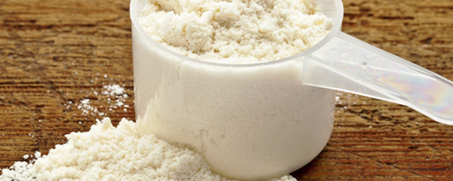
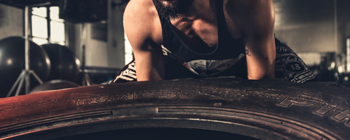
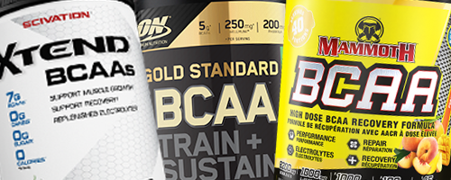

# Les suppléments BCAA: Que devez-vous savoir?

## Que devez-vous savoir sur les BCAAs

- Les BCAA sont très importants pour **construire de la masse musculaire, aider la récupération musculaire et de l'énergie**. La masse musculaire affecte positivement votre métabolisme, ce qui est crucial pour **perdre du poids**.
- La leucine est le plus bénéfique des trois BCAA. Par conséquent, lorsque vous achetez, **trouvez le produit avec la plus grande quantité de leucine**.
- Les BCAA aident lors d'un programme de musculation (*résistance*) et/ou de perte de poids.

 

## C'est quoi les BCAAs? 

>### Réponse courte
>**Des suppléments qui vous aident à développer vos muscles et à perdre du poids lorsque vous suivez un programme de musculation.**

### Longue réponse

Les acides aminés à chaîne ramifiée (BCAA) sont parmi les **acides aminés essentiels** pour nous, ils sont:
 - Valine, 
 - Isoleucine, et 
 - Leucine. 
 

Ils sont considérés comme essentiels parce que **nos corps ne peut pas les fabriquer** et nous devons **les récupérer grâce à nos régimes alimentaires**.

Ils aident à la **croissance et la récupération musculaire**. Étant donné que la plupart des sources de protéines en sont riches, il est généralement inutile de les compléter. Cependant, ils sont souvent pris dans l'objectif de **stimuler la croissance musculaire et d'améliorer les performances physiques** lors de la musculation.

 

## Quand prendre les BCAAs? 

>### Réponse courte
>**Il n'y a pas de différence apparente entre les prendre avant ou après, c'est fondamentalement la même chose.**

### Longue réponse

En générale, les effets des BCAA sont les mêmes n'importe quand on les prennent (après, avant ou pendant votre séance d’entraînement), comme indiqué dans cette [étude](https://www.ncbi.nlm.nih.gov/pubmed/15173434) par *The Department of Materials Science and Engineering at Nagoya Institute of Technologya* au Japon.  
L'étude a conclu que "**la supplémentation en BCAA avant et après une séance d’entraînement a des effets bénéfiques** en réduisant les dommages musculaires induits par l'exercice et en favorisant la synthèse des protéines musculaires; ceci suggère la possibilité que les BCAA soient un complément utile en musculation".

#### Prendre des BCAAs avant ou pendant une séance d'entraînement

Boire les BCAAs (qui est le **moyen le plus simple** de les consommer, en quantités intéressantes) un peu avant ou pendant votre séance d’entraînement vous procurera un peu de protection contre le catabolisme (**décompositon des molécules de protéines**)

Ils pourraient vous aider avec votre niveau d'énergie pendant votre séance d'entraînement, mais cela dépend généralement du produit que vous achetez.

#### Prendre des BCAA après un entraînement

La consommation de BCAA après votre entraînement vous aidera à reconstituer le tissu musculaire et à gagner de la masse musculaire.

#### Prenant des BCAA en jeûnant

Si vous vous entraînez en jeûnant (par exemple, pas de repas solides dans les 16 heures, que ce soit pour un jeûne intermittent ou pour une autre raison), les BCAA peuvent jouer le rôle de *vraie* protéine pendant un certain temps.

 

## les BCAAs pour perdre du poids et la prise de masse?

>### Réponse courte
>**Oui. Et il y'en a une [étude](https://www.ncbi.nlm.nih.gov/pmc/articles/PMC3313152/) pour le prouver.**

### Longue réponse

 

#### Perte de graisse et gain musculaire: whey ou bcaa

Les acides aminés à chaîne ramifiée peuvent aider à perdre du poids, comme conclu dans une [étude](https://www.ncbi.nlm.nih.gov/pmc/articles/PMC3313152/) menée par le *Weider Research Group* sur "36 hommes avec au moins deux ans d'expérience en entraînement".  
L'étude a conclu que **l'ingestion de BCAA pendant un programme de musculation entraînait une forte diminution du pourcentage de graisse corporelle** et "une augmentation de la masse maigre, ainsi que des gains de force sur le bench et le squat" par rapport à *l'ingestion d'un supplément de whey ou d'une boisson pour sportifs ".

#### Aider à reconstruire le tissu musculaire après une séance d'entraînement

Une autre [étude](https://www.ncbi.nlm.nih.gov/pubmed/22569039) par *The School of Life Sciences at Northumbria University* menée  sur "12 hommes" a conclu que la prise de BCAA avant et après les séances d'entraînement **réduit les dommages musculaires et augmente la vitesse de récupération**.
 

## Quel dosage pour les BCAAs?

>### Réponse courte
>| Niveau d'activité (séance/semaine)| Homme  (max: ~20g/jour) | Femme (max: ~10g/jour) |
| :------------------- | -------------------: |:---------------:|
| Assez actif (1-3/semaine)| 1 or 2 portions      | 1 or 2 portions |
| Très actif (3-4/semaine)         | 3 portions           |  2 portions     |
| Extrêmement actif (+4/semaine)    | 4 portions           | 2 portions      |

### Longue réponse

Tout comme pour la régulation de la prise des protéines, les BCAA sont fondamentalement les mêmes. Ajouter plus n'est pas nécessairement beaucoup mieux et parfois ils ne sont pas utiles du tout. La quantité des BCAA à prendre dépend fortement de votre sexe et de votre niveau d’activité.

#### Dosage de BCAA et perte de poids

**Une ou deux portions** sont la dose générale recommandée pour perdre du poids. Toutefois, si vous faites des séances d’entraînement en jeûnant, il est conseillé d’ajouter une autre portion (*2 pour les exercices standard, 3 pour les exercices en jeûnant*).

#### Dosage de BCAA et votre degré d'activité

Pour le niveau d'activité:
- **Pour les personnes relativement actives** (*2-3 séances de musculation par semaine*): Une portion avant et une seconde après l'entraînement suffisent généralement.
- **Pour les personnes très actives** (*3-4 jours par semaine*): Ajoutez une autre portion juste avant de se coucher pour aider à la récupération musculaire.
- **Pour les très actifs** (*+4 jours par semaine*): Le nombre suggéré est généralement 4 portions, à condition que vous répartissiez ces portions tout au long de la journée.

#### Dosage de BCAA et votre sexe, combien de BCAA pour les femmes?

De manière générale, les femmes n'ont pas besoin d'autant de BCAA que les hommes pour atteindre un objectif de musculation et de perte de poids.  
Cependant, il est généralement recommandé que **les femmes n'ont besoin que de 5 à 10 g de BCAA par jour (soit 1 à 2 portions**), alors que les **hommes peuvent en consommer entre 10 et 20 g par jour**. (Cela dépend évidemment aussi des facteurs mentionnés ci-dessus).

 

## Quels sont les dangers des BCAA?

>### Réponse courte
>**Aucune, sauf si vous en utilisez beaucoup trop (comme pour tout), des problèmes de santé peuvent survenir.**

### Longue réponse

La plupart des nutritionnistes experts suggèrent que la consommation quotidienne de BCAAs est sans danger, à condition de ne pas en dépasser les quantités suggérées (**Plus de ~ 20g par jour**).

#### Effets secondaires de trop de BCAA

Prendre **trop de** BCAA peut causer de la fatigue, des nausées, des maux de tête et peut dans certains cas entraîner une augmentation de la résistance à l'insuline (pouvant être à l'origine du diabète de type 2).

#### Quand ne pas prendre les BCAAs?

- Si vous buvez **trop** d'alcool
- Si vous subissez une intervention chirurgicale parce qu'elle affecte le taux de sucre dans le sang.
- Si vous avez l'une des conditions suivantes:
  - Maladie urinaire du sirop d'érable
  - Maladie rénale
  - Maladie du coeur
  - Maladie de Lou Gehrig (SLA)

 

## Quelle BCAA choisir?

1. **Choisissez ce que vous pensez est comfortable pour vous:**
     - **Poudre**: Vous pourrez peut-être la boire avec de l'eau au fur et à mesure de votre entraînement.
     - **Comprimés / Capsules**: Si vous voulez simplement en finir avec, alors les comprimés et les gélules sont la solution.

1. **Choisissez un bon ratio:**  
     Le rapport est une chose très importante à considérer, comme mentionné précédemment **La leucine est le plus important des acides aminés**.  
     Les ratios sont écrits comme ceci: X.Y.Z (par exemple bcaa 4.1.1 ou 2.1.1), le premier nombre correspondant au Leucine. Il est donc conseillé de **choisir un produit contenant une bonne quantité de leucine**.

1. **Le Prix, évidemment:**  
    Choisissez un produit en fonction de votre budget, cependant, soyez sélectif et sachez ce que vous faites entrer dans votre système (le moins cher peut aussi être mauvais pour votre corps).

 

## Références

https://en.wikipedia.org/wiki/Branched-chain_amino_acid  
https://www.reddit.com/r/Fitness/comments/29okyo/can_anyone_help_me_understand_the_need_for_bcaas/  
https://www.healthline.com/nutrition/bcaa  
https://www.ncbi.nlm.nih.gov/pmc/articles/PMC3313152/  
https://www.ncbi.nlm.nih.gov/pubmed/22569039  
https://www.ncbi.nlm.nih.gov/pubmed/15173434  
https://ronniecoleman.net/blogs/articles/beginners-guide-to-bcaas  
https://ironjunkies.com/bcaa-dosage  
https://blog.blenderbottle.com/all-about-bcaas-bcaa-benefits-uses-and-side-effects  
http://blog.imprettyfit.com/supplements/bcaa-supplements-for-fat-loss/  
https://athleticmuscle.net/best-bcaas-for-men/
